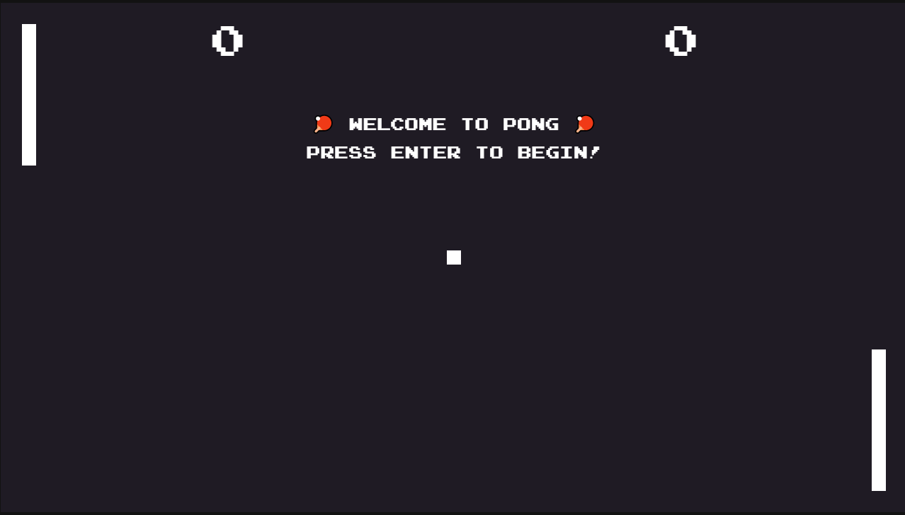
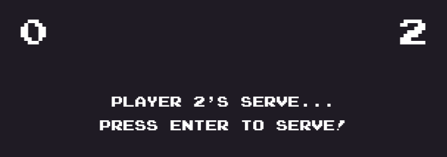
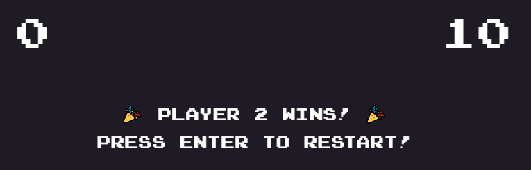

# Pong

## The game features two paddles and a ball, the goal is to defeat your opponent by being the first one to gain 10 points, a player gets a point once the opponent misses a ball.

## At the start and after points, the ball is served

## When the ball goes past either the player's side, or the AI's side, a point is granted and the game goes back to serving.

## Once one side gets to 10 points, they win.
