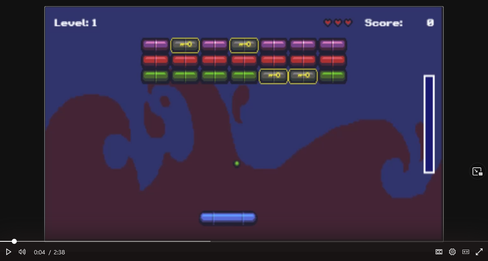

# Assignment 2 - Breakout 🧱

- 💯**Worth**: 4%
- 📅**Due**: September 11, 2022 @ 23:59
- 🙅🏽‍**Penalty**: Late submissions lose 10% per day to a maximum of 3 days. Nothing is accepted after 3 days and a grade of 0% will be given.

## 🎯 Objectives

- Read and understand all of the Breakout [notes](https://jac-cs-game-programming-fall22.github.io/Notes/#/1-Breakout/) and [source code](https://github.com/JAC-CS-Game-Programming-Fall22/1-Breakout) from Lecture 1.
- Add a multi-ball power-up to the game that spawns two extra balls.
- Grow and shrink the paddle when the player gains enough points or loses a life.
- Add a locked brick that will only open when the player collects a key power-up.
  - The key should only spawn when a locked brick exists.

## 🎥 Demo

[](https://web.microsoftstream.com/video/4b9806c9-119b-4928-97ee-3b8cfa476c33 "Breakout Demo")

_You'll have to sign in with your JAC email to view the video._

## 🔍 Context

Welcome to your second assignment! By now, we've gotten our feet wet with states, randomization, and much more; this time, we'll be diving in further and adding some new features entirely!

1. 💪 **Add a multi-ball `PowerUp` class** to the game that spawns a power-up (images located at the bottom of the sprite sheet).
   1. This should spawn randomly at the location of the brick when the ball hits a brick, and should gradually descend down the screen so that the player can "pick it up" with the paddle.
      - It'll be up to you to decide whether more than one power-up can be on the screen at any given time, or whether the player should be allowed to "stack" multiple power-ups.
   2. If the power-up collides with the paddle, the power-up should despawn and two more balls should spawn (at whatever location you choose) and behave identically to the original, including all collision detection and scoring points.
   3. You should only lose a life and transition to the `ServeState` when the last of the balls falls below the screen.
      - Once the last ball falls, reset the number of balls back to 1 and number of power-ups back to 0.
   4. Once the player wins and proceeds to the `VictoryState` for their current level, reset the number of balls back to 1 for the new level.
2. 💗 **Grow and shrink the paddle** such that it's no longer just one fixed size for the entire game.
   1. The paddle should shrink (no smaller than the smallest paddle sprite) if the player loses a life.
   2. The paddle should grow (no larger than the largest paddle sprite) if the player exceeds a certain amount of score.
      1. The paddle should grow from size **0** to size **1** after the player accumulates **50 points**.
      2. The paddle should grow from size **1** to size **2** after the player accumulates **100 points**.
      3. The paddle should grow from size **2** to size **3** after the player accumulates **200 points**.
   3. Here's how it should work:

      ```javascript
      // Paddle Size 0 -> 1: +50 points
      // Paddle Size 1 -> 2: +100 points
      // Paddle Size 2 -> 3: +200 points
      Paddle = 1; Life = 3; Score = 0;   // Game start
      Paddle = 2; Life = 3; Score = 100; // Score +100, paddle size 1 -> 2
      Paddle = 1; Life = 2; Score = 100; // Life -1,    paddle size 2 -> 1
      Paddle = 0; Life = 1; Score = 100; // Life -1,    paddle size 1 -> 0
      Paddle = 1; Life = 1; Score = 150; // Score +50,  paddle size 0 -> 1
      Paddle = 2; Life = 1; Score = 250; // Score +100, paddle size 1 -> 2
      Paddle = 3; Life = 1; Score = 450; // Score +200, paddle size 2 -> 3
      ```

3. 🔐 **Add a locked brick** (located in the sprite sheet) to the level spawning, as well as a key power-up (also in the sprite sheet).
   1. The locked brick should not be breakable by the ball normally, unless the player obtained the key power-up.
   2. The key power-up should spawn randomly (just like the multi-ball power-up) when hitting a brick and descend toward the bottom of the screen where the paddle can collide with it and pick it up.
      - No keys should spawn if there are no locked bricks in play.
   3. You'll need to take a look at the `LevelMaker` class to see how you can implement the locked brick into the level generation.
      - To make it easier to test, ensure that every level has at least 1 locked brick.
      - Perhaps make them worth significantly more points as well in order to make them worth the extra effort to break.
   4. There is a chance for the player to get "soft locked" meaning that it's possible to have a scenario where the player breaks all the regular bricks and now there are only locked bricks left. Since keys can only spawn from regular bricks, the player is now stuck. For this assignment, this is okay, you do not have to account for this edge case. However, if you like an extra challenge, try implementing your own solution for this soft lock!

## 🌿 Git

You can use either the Git CLI or you can also use VSC's built-in Git GUI client.

### 🖱️ GUI

1. In VSC, click on the third icon down in the left navigation bar to see a list of files that have changed and are ready to be staged.
2. Hover over where it says _Changes_ (right below the commit textbox) and click `+` to stage all the modified files to be committed. Alternatively, you can add specific files by clicking the `+` next to the individual file.
3. Type a commit message into the textbox and click the checkmark above it to commit all the files that were just staged.
4. Click `...` and then `push` to push the commit(s) up to GitHub.

### ⌨️ CLI

1. Run `git status` to see a list of files that have changed and are ready to be staged.
2. Run `git add .` to stage all the modified files to be committed. Alternatively, you can add specific files like this: `git add src/Brick.js`.
3. Run `git commit -m "A descriptive message here."` (including the quotes) to commit all the files that were just staged.
4. Run `git push` to push the commit(s) up to GitHub.

Regardless of the method you choose, it is very important that you commit frequently because:

- If you end up breaking your code, it is easy to revert back to a previous commit and start over.
- It provides a useful log of your work so that you (and your teammates if/when you're on a team) can keep track of the work that was done.

## 📥 Submission

> 💡 Note that the grading criteria can be found on Gradescope, but only after you've submitted. You're able to submit infinitely, so submit a blank repo first in order to reference the grading criteria while working on this assignment.

Once you've made your final `git push` to GitHub, here's what you have to do to submit:

1. Go to [Gradescope](https://www.gradescope.ca/courses/7664) and click the link for this assignment.
2. Select the correct repository and branch from the dropdown menus.
3. Click _Upload_.
4. Record a screencast, **not to exceed 5 minutes in length**, in which you demonstrate your game's functionality.
   - The video should be recorded and uploaded using Microsoft Stream. [Please watch this instructional video on how to do so](https://web.microsoftstream.com/video/62738103-211f-4ddd-bb4a-c594eddcfb0a) (you'll have to log in with your JAC email and password).
     - In the instructional video I mention to toggle on the "share sound" option. I later realized that it might be hard to hear what you'll be saying if the game music is playing, so please toggle off the "share sound" option. Alternatively, you can comment out the line in `Game.js` that starts the music.
     - While recording, make sure to zoom in on the web page to have the game take up most of the screen. You can zoom by hitting `CMD + +` (Mac) or `CTRL + +` (Windows).
   - In your video's description, please timestamp where each of the following occurs in your gameplay demonstration:
     - Multi-ball power-up
     - Paddle growing/shrinking
     - Key power-up obtained
     - Locked block unlocked
