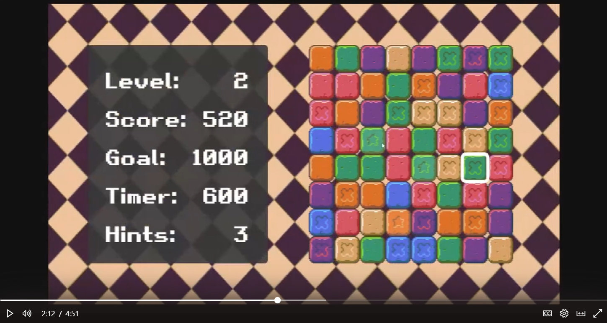

# Assignment 2 - Match 3 🧩

- 💯**Worth**: 5%
- 📅**Due**: September 25, 2022 @ 23:59
- 🙅🏽‍**Penalty**: Late submissions lose 10% per day to a maximum of 3 days. Nothing is accepted after 3 days and a grade of 0% will be given.

## 🎯 Objectives

- Read and understand all of the Match 3 [notes](https://jac-cs-game-programming-fall22.github.io/Notes/#/2-Match-3/) and [source code](https://github.com/JAC-CS-Game-Programming-Fall22/2-Match-3) from Lecture 2.
- Implement time addition on matches such that scoring rewards the player by extending the time they have to complete the level.
- Gradually add new patterned tiles as the player progresses through the levels. Tiles of a higher pattern should be worth more points.
- The star tile should be a very rare tile that will destroy an entire row on match, granting points for each tile in the row.
- Only allow swapping when it results in a match.
- Implement a "hint" feature such that when the player presses `h`, it will reveal a pair of tiles that can be swapped to create a match.

## 🎥 Demo

_You'll have to sign in with your JAC email to view the video._

## 🔍 Context

Welcome to your third assignment! There was a lot to learn with timers & tweens, but our game is still lacking in a few areas. By extending its functionality, we'll have something even closer to famous titles such as Bejeweled and Candy Crush Saga!

1. ⏰ Implement **time addition on matches**, such that scoring a match extends the timer. You decide how much time is appropriate to reward the player with on each match.

   > 💡 Hint: Currently, there's code that calculates the amount of points you'll want to award the player when it calculates any matches in `PlayState::calculateMatches()`, so start there.

2. 🌈 Ensure level 1 starts just with simple flat tiles (the first of each colour in the sprite sheet), with **later levels generating the tiles with patterns** on them (like the triangle, cross, etc., **excluding star**). These should be worth more points, at your discretion.
   - To detect a match, you'll still only have to check the colour of the tile; the patterned tiles only change the amount of points gained.
   - For example, a flat tile (`🟩`) could be worth 10 points and a cross tile (`❎`) could be worth 20. A match that was `🟩❎🟩` (all the same colour of course) would be worth 40 points.

   > 💡 Hint: Right now, colours and patterns are chosen in `Board::generateTile()`. One idea could be to pass in the level variable when a `Board` is created, and let that influence what pattern is chosen for the given level.

3. ⭐ The star tile (the last of each colour in the sprite sheet) should be **a rare tile that will destroy an entire row or column on a match** (depending on the match direction), granting points for each tile in the row or column.
   - For example, if you have a match in a column of 3 orange tiles, one of the tiles in the match being an orange star tile, then that entire column should be removed and points should be awarded for every tile in that column, regardless of if they're orange or not.
   - Take care to make sure the points are being added up correctly and that no tile is being counted multiple times.

   > 💡 Hint: First, think about how to generate the star tiles such that they show up on every level but are rare. Second, you'll have to detect that a match contains a star tile when running `Board::calculateMatches()` and remove the entire row or column.

4. 🚫 Only allow swapping when it results in a match.

   > 💡 Hint: The simplest way is probably just to try and test if there was a match after a swap and revert back if there was no match.

5. ❓ Show the player a hint when they press the `h` key. A hint is showing the player 2 tiles they can swap which will result in a match. The way you display the hint is up to you; it can be a simple rectangle or a fancy animation using timers and tweens.

   > 💡 Hint: One way to do this is to loop through the board, do a temporary swap in memory (i.e. not visually), check if that resulted in a match, then revert the swap.

## 🌿 Git

You can use either the Git CLI or you can also use VSC's built-in Git GUI client.

### 🖱️ GUI

1. In VSC, click on the third icon down in the left navigation bar to see a list of files that have changed and are ready to be staged.
2. Hover over where it says _Changes_ (right below the commit textbox) and click `+` to stage all the modified files to be committed. Alternatively, you can add specific files by clicking the `+` next to the individual file.
3. Type a commit message into the textbox and click the checkmark above it to commit all the files that were just staged.
4. Click `...` and then `push` to push the commit(s) up to GitHub.

### ⌨️ CLI

1. Run `git status` to see a list of files that have changed and are ready to be staged.
2. Run `git add .` to stage all the modified files to be committed. Alternatively, you can add specific files like this: `git add src/Tile.js`.
3. Run `git commit -m "A descriptive message here."` (including the quotes) to commit all the files that were just staged.
4. Run `git push` to push the commit(s) up to GitHub.

Regardless of the method you choose, it is very important that you commit frequently because:

- If you end up breaking your code, it is easy to revert back to a previous commit and start over.
- It provides a useful log of your work so that you (and your teammates if/when you're on a team) can keep track of the work that was done.

## 📥 Submission

> 💡 Note that the grading criteria can be found on Gradescope, but only after you've submitted. You're able to submit infinitely, so it might be a good idea to submit a blank repo first in order to reference the grading criteria while working on this assignment.

Once you've made your final `git push` to GitHub, here's what you have to do to submit:

1. Go to [Gradescope](https://www.gradescope.ca/courses/7664) and click the link for this assignment.
2. Select the correct repository and branch from the dropdown menus.
3. Click _Upload_.
4. Record a screencast, **not to exceed 5 minutes in length**, in which you demonstrate your game's functionality.
   - The video should be recorded and uploaded using Microsoft Stream. [Please watch this instructional video on how to do so](https://web.microsoftstream.com/video/62738103-211f-4ddd-bb4a-c594eddcfb0a?list=studio) (you'll have to log in with your JAC email and password).
     - Please upload the video to the correct "channel" (i.e. playlist).
     - In the instructional video I mention to toggle on the "share sound" option. I later realized that it might be hard to hear what you'll be saying if the game music is playing, so feel free to toggle off the "share sound" option if you find that it's hard to hear yourself over the music in the recording.
   - Feel free to increase the `maxTimer` value in `PlayState` to give yourself time to demonstrate your game effectively.
   - In your video's description, please timestamp where each of the following occurs in your gameplay demonstration:
     - Disallow no-match swaps
     - Time addition
     - Tile patterns by level
     - Star tile
     - Hints
