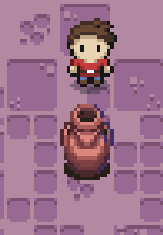
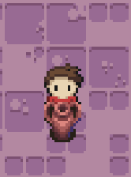
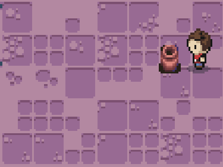
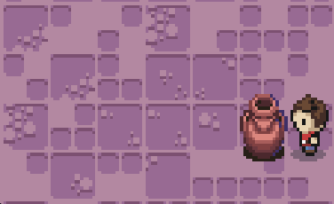
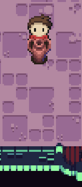
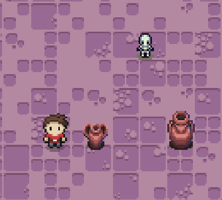
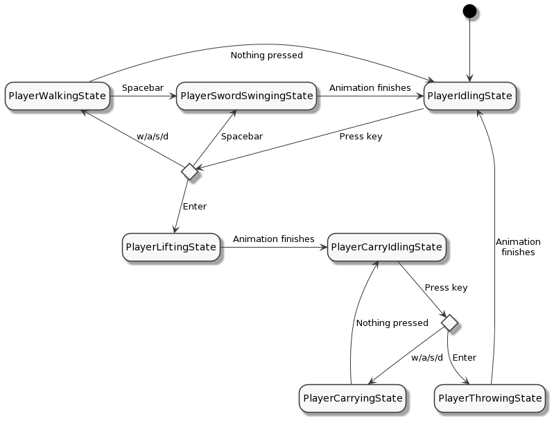

# Assignment 4 - Zelda ⚔️

- 💯**Worth**: 6%
- 📅**Due**: October 23, 2022 @ 23:59
- 🙅🏽‍**Penalty**: Late submissions lose 10% per day to a maximum of 3 days. Nothing is accepted after 3 days and a grade of 0% will be given.

## 🎯 Objectives

- Read and understand all of the Zelda [notes](https://jac-cs-game-programming-fall22.github.io/Notes/#/4-Zelda/) and [source code](https://github.com/JAC-CS-Game-Programming-Fall22/4-Zelda) from Lecture 4.
- Implement hearts that sometimes drop from enemies at random, which will heal the player for a full heart when picked up (consumed).
- Add pots to the dungeon rooms at random that the player can pick up, at which point their animation will change to reflect them carrying the pot (shown in the character sprite sheets). The player should not be able to swing their sword when in this state.
- When carrying a pot, the player should be able to throw the pot. When thrown, the pot will travel in a straight line based on where the player is looking. When it collides with a wall, travels more than four tiles, or collides with an enemy, it should disappear. When it collides with an enemy, it should do 1 point of damage to that enemy as well.

## 🔍 Context

Welcome to your fifth assignment! We've explored the workings of a top-down adventure game in the style of Legend of Zelda and have a fair foundation for anything resembling it, be it a dungeon crawler or a vast 2D game featuring an overworld and the like. Let's add a few pieces to this sample in order to pay homage to some of the classic Zelda titles and to give our character a shot at actually surviving their trek through the dungeon!

### 💕 Hearts

**Implement hearts** that sometimes drop from vanquished enemies at random, which will heal the player for a full heart (two health points) when picked up (consumed).

Recall that all instances of `Entity` have a `health` field, including the `Player`. The `health` of the `Player` is measured numerically but represented via hearts where one heart is two points of health and one half-heart is one point of health. Therefore, when we want to heal the `Player` for a full heart, be sure to increment `health` by 2, but be careful it doesn't go above the `totalHealth`!

> 💡 Hint: Implementing a `GameObject` that has an `onConsume` function is probably of interest here. We've learned about consumable objects in Mario, so please use that as a reference! We're already using the heart sprites in `src/services/UserInterface.js` so you can use that as reference as well.

### 🍯 Pots

Add pots to the dungeon rooms at random that the player can pick up and throw. The pots should be solid, meaning, the player should not be able to walk through them just like with the `Block` from Mario.

The sprites for the pots can be found in `assets/images/pots.png`. You don't have to implement all three sizes, just one is fine.

#### 🏋️‍♀️ Lifting

When the player is facing a pot that is in directly in front of them, they should be able to hit the enter key to pick up the pot. While the lifting animation is playing, the pot's position should be tweened to above the player's head to make it appear as if the player lifted the pot and is holding the pot above their head.

- The sprites for this animation can be found in `assets/images/player_lift.png`.

#### 🤰 Carrying

After the player has lifted the pot above their head, they should be able to carry it around.

- The sprites for this animation can be found in `assets/images/player_carry.png`.
- This will entail not only adding some new states for the `Player` but also ensuring a link exists (pun intended 🧝‍♂️) between the pot and the character such that the pot always tracks the player's position so it can be rendered above their head.
- When the player is in this state, they should not be able to swing their sword since their hands are full at the moment!

#### 🏀 Throwing

While carrying a pot, the player should be able to hit the enter key again to throw the pot in front of them. When thrown, the pot should travel in a straight line based on which direction the player is facing.

If the pot travels more than X tiles worth of distance, determined by you, it should break:

If the pot hits a wall, it should break:

If the pot hits an enemy, it should break:

- The sprites for this animation are exactly the same as the one for lifting only played in reverse. Think about how you can specify the frames of a `new Animation()` to play something in "reverse".
- Upon collision with an enemy it should deal 1 damage to the enemy which, if the enemy only has 1 health, should kill them.
- When the pot breaks, it should play the breaking animation (also provided in the sprite sheet) as well as play a shattering sound effect (`assets/sounds/shatter.wav`).

#### 🤖 State Diagram

You don't have to design your game like this, but I figured it might help people who might be having trouble visualizing how the player's state machine should work:

#### 💡 Work Smarter

- You're going to be starting the game over and over and over again, dozens of times. Instead of going through the title screen every time you refresh, make it so that you start in the play state from the outset.
- When testing a particular feature you're implementing, hardcode the parameters to work to your advantage.
  - For example, before making the hearts random, make them drop 100% of the time. Once you know that's working, then make them drop randomly.
  - Or, when implementing pots, always have one spawn right next to the player so you don't have to walk across the room to pick one up every time. Make the locations random at the end!

Taking the time at the beginning to set up your game in a state that is conducive to testing will save you tons of time down the road - trust me! And this isn't just for game programming, this goes for any type of development you do. 😉

## 🌿 Git

You can use either the Git CLI or you can also use VSC's built-in Git GUI client.

### 🖱️ GUI

1. In VSC, click on the third icon down in the left navigation bar to see a list of files that have changed and are ready to be staged.
2. Hover over where it says _Changes_ (right below the commit textbox) and click `+` to stage all the modified files to be committed. Alternatively, you can add specific files by clicking the `+` next to the individual file.
3. Type a commit message into the textbox and click the checkmark above it to commit all the files that were just staged.
4. Click `...` and then `push` to push the commit(s) up to GitHub.

### ⌨️ CLI

1. Run `git status` to see a list of files that have changed and are ready to be staged.
2. Run `git add .` to stage all the modified files to be committed. Alternatively, you can add specific files like this: `git add src/Coin.js`.
3. Run `git commit -m "A descriptive message here."` (including the quotes) to commit all the files that were just staged.
4. Run `git push` to push the commit(s) up to GitHub.

Regardless of the method you choose, it is very important that you commit frequently because:

- If you end up breaking your code, it is easy to revert back to a previous commit and start over.
- It provides a useful log of your work so that you (and your teammates if/when you're on a team) can keep track of the work that was done.

## 📥 Submission

> 💡 Note that the grading criteria can be found on Gradescope, but only after you've submitted. You're able to submit infinitely, so it might be a good idea to submit a blank repo first in order to reference the grading criteria while working on this assignment.

Once you've made your final `git push` to GitHub, here's what you have to do to submit:

1. Go to [Gradescope](https://www.gradescope.ca/courses/7664) and click the link for this assignment.
2. Select the correct repository and branch from the dropdown menus.
3. Click _Upload_.
4. Record a screencast, **not to exceed 5 minutes in length**, in which you demonstrate your game's functionality.
   - The video should be recorded and uploaded using Microsoft Stream. [Please watch this instructional video on how to do so](https://web.microsoftstream.com/video/62738103-211f-4ddd-bb4a-c594eddcfb0a?list=studio) (you'll have to log in with your JAC email and password).
     - In the instructional video I mention to toggle on the "share sound" option. I later realized that it might be hard to hear what you'll be saying if the game music is playing, so feel free to toggle off the "share sound" option if you find that it's hard to hear yourself over the music in the recording.
     - While recording, make sure to zoom in on the web page to have the game take up most of the screen. You can zoom by hitting `CMD + +` (Mac) or `CTRL + +` (Windows).
   - In your video's description, please timestamp where each of the following occurs in your gameplay demonstration:
     - Heart spawns/does not spawn from dead enemies thereby showing this spawn is random
     - Heart is consumed by the player and grants more health
     - Health does not go above maximum health
     - Pot lift (all directions)
     - Pot carry (all directions)
     - Pot throw (all directions)
       - For each direction, show each type of collision (wall, enemy, distance)
   - Add your video to the correct Stream channel for this assignment. Instructions for this are in the video link above.
